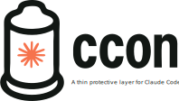

<div align="center">
    
</div>
<hr>


**ccon** (Claude Container, or Claude Condom if you're so inclined) provides essential protection while Claude Code is up close and personal with your system.

## Why protection matters

Running Claude Code with `--dangerously-skip-permissions` feels great - fast, responsive, no interruptions. But going in unprotected has risks.

**ccon lets you have it both ways: all the pleasure of autonomous Claude, with a barrier between Claude and your machine's sensitive areas.**

### The problem with exposure
- **Leaves Claude Unprotected**: Lightning fast but vulnerable to nasty prompt injections
- **Mood killer**: Constant permission prompts kill the flow

### Protected interaction
- **Smooth operation**: No more constant permission prompts
- **Barrier protection**: Keeps unwanted side effects contained
- **Peace of mind**: Enjoy the experience without worry
- **Easy cleanup**: Fresh environment every time

## Quick start

### Installation
```bash
curl -fsSL https://raw.githubusercontent.com/nikvdp/ccon/master/install.sh | bash
```

### Usage
```bash
ccon "write a hello world script"
ccon "help me refactor this code"
```

## Design philosophy

**ccon gets out of your way.** It's designed to feel natural - like using Claude directly, just safer.

- **Thin layer**: Barely noticeable protection
- **Natural feel**: Works exactly like `claude` but protected
- **No surprises**: Everything you expect, just contained
- **Seamless experience**: Your environment, your files, your workflow

You should barely notice `ccon` is there, except for that reassuring feeling of safety.

## How it works

**ccon runs Claude Code inside a Docker container.** This creates a sandboxed environment where Claude can operate with full autonomy while being isolated from your host system.

- **Docker sandbox**: Claude runs in an isolated container with its own filesystem
- **Host file access**: Your project files are mounted so Claude can read and edit them
- **Network isolation**: Claude's web access is contained within the container
- **Credential management**: Authentication is handled securely without exposing host credentials
- **Full toolchain**: Container includes development tools, languages, and utilities Claude needs

The result? Claude gets the `--dangerously-skip-permissions` experience it needs to be productive, while potential risks are contained within the sandbox.

## Installation

### One-liner install
```bash
curl -fsSL https://raw.githubusercontent.com/nikvdp/ccon/master/install.sh | bash
```

### Manual setup
```bash
git clone https://github.com/nikvdp/ccon.git
cd ccon
chmod +x ccon
sudo ln -s "$PWD/ccon" /usr/local/bin/ccon
```

## Usage

### Basic operation
```bash
# Interactive session
ccon

# Direct commands  
ccon "analyze this codebase"
ccon --resume  # Claude Code option passed through

# Get help
ccon --help
```

### Advanced options
```bash
# Rebuild the protective layer (also updates to latest Claude Code version)
ccon --rebuild

# System information and status
ccon --info

# Shell access for inspection
ccon --shell
ccon --shell 'ls -la'  # Run shell commands

# Custom environment
ccon --env API_KEY=sk-123

# Additional apt packages
ccon --packages terraform,kubectl

# Enable Docker access
ccon --docker

# Update ccon installation
ccon --self-update

# Clean up containers
ccon --cleanup
```

### Experimental features
⚠️ **These features are experimental and may have edge cases. Use with caution.**

```bash
# OAuth token refresh (EXPERIMENTAL)
# Allows Claude to refresh expired tokens and sync back to host system
ccon --allow-oauth-refresh "help me code"

# Credential management (EXPERIMENTAL)  
# Backup and restore Claude Code credentials for safety
ccon backup-creds                    # Backup current credentials
ccon restore-creds                   # Restore from most recent backup
ccon restore-creds backup-file.json  # Restore from specific backup
```

**OAuth refresh feature**: Enables bidirectional credential sync when Claude refreshes expired tokens. Uses race condition protection and creates automatic backups.

**Credential management**: Provides manual backup/restore of Claude Code credentials with cross-platform support (macOS Keychain + Linux files).

## Command Pass-through

ccon acts as a wrapper - any options it doesn't recognize get passed directly to Claude Code:

```bash
# These Claude Code options work normally
ccon --resume
ccon --model claude-3-5-sonnet-20241022 "write tests"
ccon --no-clipboard "analyze this file"

# Mix ccon and Claude options
ccon --env DEBUG=1 --resume  # ccon + Claude options
```

## Configuration

### Environment setup
ccon passes through everything you need:
- `ANTHROPIC_API_KEY` - Direct access
- Terminal settings (`TERM`, `NO_COLOR`)
- Git configuration
- Locale and timezone

### Project-level config
```bash
# Use .env files
echo "DEBUG=1" > .env
ccon
```

## Requirements

- **Docker**: Must be running
- **Claude Code**: Must be authenticated
- **Bash**: For the wrapper

### Authentication
ccon automatically finds your Claude credentials:
- **macOS**: Extracts from Keychain
- **Linux**: Uses `~/.claude/.credentials.json` or config directory
- **Environment**: `ANTHROPIC_API_KEY` passed through to container

## Architecture

### Container specs
- Node.js 20 with development tools
- Modern CLI utilities (jq, ripgrep, fzf)
- Multiple language support
- Database clients and network tools

### Safety features
- Isolated environment
- Secure credential mounting
- Proper permission mapping
- Fresh session every time

## Examples

### Development workflow
```bash
cd my-project
ccon
ccon "add tests to the auth module"
ccon --resume
```

### CI/CD usage
```bash
export ANTHROPIC_API_KEY=sk-key
ccon "review this pull request"
```

## Troubleshooting

**Authentication issues**
- Run `claude` first to authenticate
- Check Claude works outside ccon

**Docker problems**
- Start Docker daemon
- Verify with `docker info`

**Permission errors**
- ccon handles user mapping automatically
- Try `ccon --rebuild` if needed

### Debug access
```bash
ccon --shell  # Get inside for inspection
```

## Security

ccon provides a significant layer of protection, but like any barrier method, it's not 100% foolproof. It's certainly better than nothing, but:

- Keep your protection up to date
- Check it's working properly before each session
- Remember that no method is perfect

**For detailed security information, threat model, and limitations, see [SECURITY.md](SECURITY.md).**

**Practice safe computing.**

## Contributing

Pull requests welcome! Please maintain all safety mechanisms.

## License

MIT License
